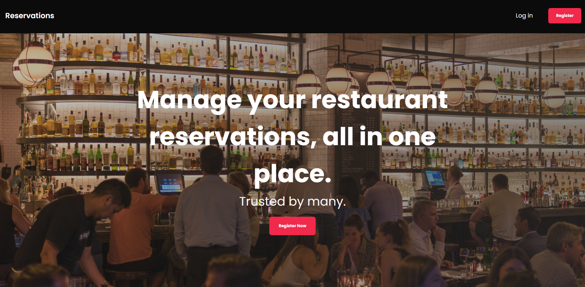
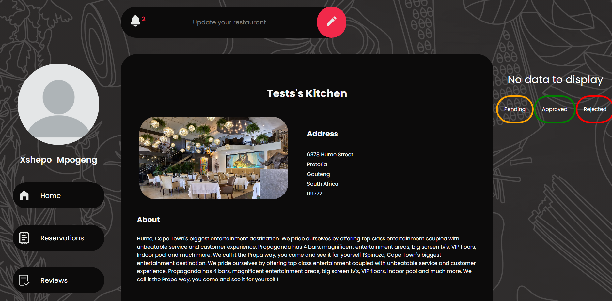

# Restaurant App | Admin

A restaurant management app where restaurant owners can add and manage their restaurant and restaurant reservations. This is the repo for the admin dashboard.

### Restaurant App | Backend

[https://github.com/Lspacedev/restaurant-app-backend](https://github.com/Lspacedev/restaurant-app-backend)

### Restaurant App | LIVE

[LIVE](https://restaurant-app-admin.vercel.app/)

## Prerequisites

- ReactJs

## Installation

1. Clone the repository

```bash
git@github.com:Lspacedev/restaurant-app-admin.git
```

2. Navigate to the project folder

```bash
cd restaurant-app-admin
```

3.  Install all dependencies

```bash
npm install
```

4. Create an env file and add the following:

```bash
VITE_PROD_URL="Deployed server url or localhost"
```

5. Run the project

```bash
npm run dev
```

## Screenshot




## Features

- Authentication: Create a user account.
- Authentication: Login to your account.

- Add your restaurant.
- View your restaurant.
- Update your information.
- Delete your restaurant.
- Track resaurant reservations.

## Usage

1. Open the live site in your browser.
2. Create an account.
3. Login.
4. Add your restaurant.

## Tech Stack

- ReactJs
- MongoDB
- NodeJs
- ExpressJs

## Credits:

```python

https://www.freepik.com/free-vector/collection-ingredients-blackboard_10252422.htm#fromView=search&page=2&position=40&uuid=0b3c7dab-c0ef-4f32-9148-9b29a4508c56&new_detail=true
Photo by Asad Photo Maldives: https://www.pexels.com/photo/empty-store-facade-with-lighted-fixtures-1449773/
Photo by Marcus Herzberg: https://www.pexels.com/photo/group-of-people-gathering-inside-bar-1058277/

```

## Moodboard:

```python
https://www.figma.com/design/Eer26qnAZHm183H81sF8a6/Restaurant-App-Design?node-id=0-1&t=FHhDdAROfPZq47Sd-1
```
